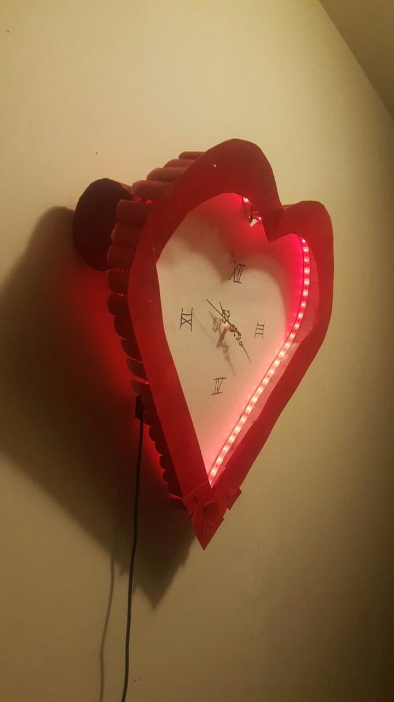
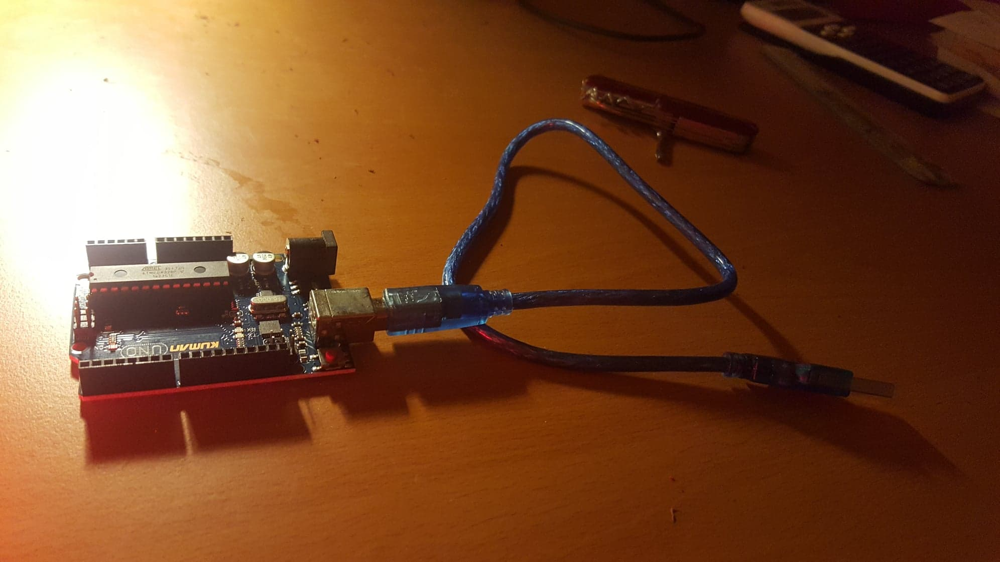
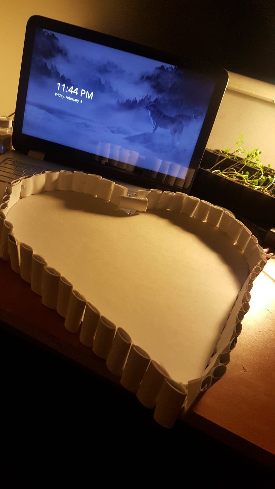

# Heartbeat-Clock
A simple clock with LEDs that simulate a heartbeat when powered 

Video can be found on this link:
https://drive.google.com/drive/folders/1h3cNlqMAk46ecU66ezacAaYAxgGZ6doq?usp=sharing 

Sample Images:

